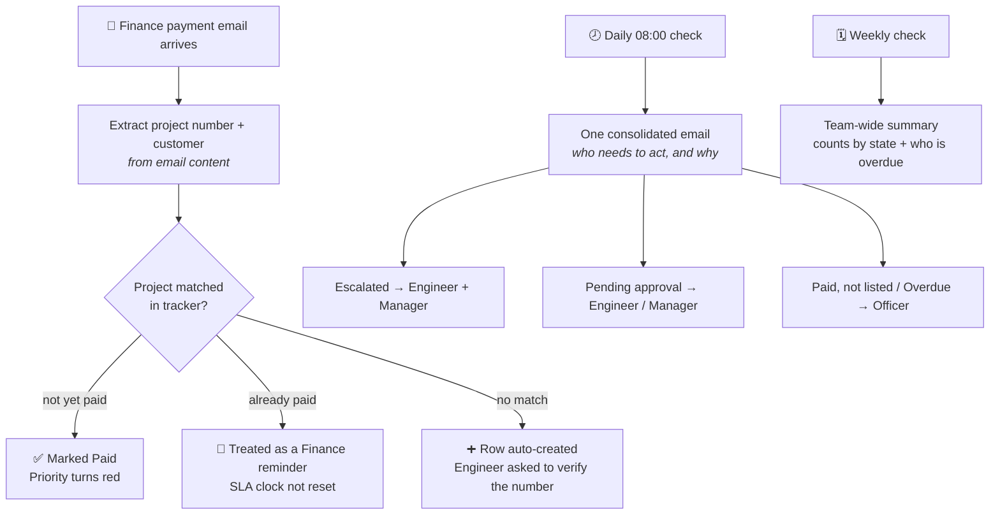

# Connection & Other Charge Tracking Automation

A Microsoft 365 automation that stops paid customer projects from being forgotten while
they wait for internal action — built without modifying any of the underlying enterprise
systems.

Created during an engineering internship with a utility's network planning team.

---

## The problem

A customer pays two charges: a **Connection Charge**, and afterwards an **Other Charge**
that an operator lists in the ERP and an engineer/manager approve. Acting on it depended
entirely on people remembering:

- Payment notification emails landed in **one busy inbox**, and never reached the shared
  tracking spreadsheet.
- When an engineer **rejected** a submitted charge, the approval task was completed and
  vanished from their inbox. Nothing in any system still held the item open.
- So a project whose customer had **already paid** could sit untouched — and nobody found out
  until Finance chased for the outstanding amount weeks later.

## The constraint

The two systems involved — the ERP and the customer-facing application portal — **could not
be modified.** No configuration changes, no plugins, no change requests.

So the solution had to sit entirely outside them, using tools the organisation already
licensed: Power Automate, Excel Online, and Outlook. Every connector used is a standard
Microsoft 365 one — no premium licensing.

---

## How it works

**Flow 1 — Payment Watcher.** Reads the project reference and customer name straight out of
the Finance email's content, updates the matching tracker row, and logs the email. A repeat
Finance reminder (even a reply to the original) is recognised and counted without resetting
the payment date. An unmatched project is added automatically rather than lost.

**Flow 2 — Daily Watchdog.** Every morning, one consolidated email tells each relevant person
what needs action — routed by who currently holds the project (operator, engineer, or
manager), not by who raised it. Needs no signal from the ERP: it detects a *stall* by
comparing status against a target date, so it catches a forgotten rejection just as well as
an unassigned project.

**Flow 3 — Weekly Summary.** A team-wide picture — how many completed, how many need
attention, and a table naming every overdue project and its owner.

---

## Repository contents

| File | What it is |
|---|---|
| [`PowerAutomate_Steps.md`](PowerAutomate_Steps.md) | Exact build steps for all three flows — triggers, actions, schemas |
| [`Scripts/`](Scripts/) | The three Office Scripts (TypeScript), as plain text |
| [`Connection_Tracker.xlsx`](Connection_Tracker.xlsx) | Reference tracker: Target Date model, Settings-driven config, calculated priority column |
| [`Finance_Email_Format_Request.md`](Finance_Email_Format_Request.md) | The standard email format requested from Finance to make notifications machine-readable |
| [`PowerAutomate_Build_Guide.md`](PowerAutomate_Build_Guide.md) | Earlier, more detailed build notes and design rationale (superseded in places by `PowerAutomate_Steps.md`, kept for context) |

### The Office Scripts

- **`MarkProjectPaid`** — reads a Finance payment email, updates or creates the matching tracker row, logs every email processed
- **`GetOverdueProjects`** — the daily check; routes by status (who holds the project) and target date (how late), returns one consolidated email
- **`GetWeeklySummary`** — the weekly team-wide picture: counts by state, and who is overdue

---

## Design decisions worth noting

**Everything configurable lives in a Settings sheet, not in code.** Thresholds, the default/
engineer/manager emails, and the officer directory are all there. Changing who gets notified,
or how late is "too late," is a spreadsheet edit — never a script edit.

**The deadline is a Target Date, not a day-count formula.** Each project carries its own date,
matching how the team already tracks deadlines on paper. "Days vs Target" is computed from it;
nobody has to remember what an SLA number means.

**Match on the email's subject wording, not the sender.** Different Finance staff send these
emails from their own accounts, but the phrasing is consistent.

**A repeat Finance email is a reminder, not a new payment.** Marking a project paid a second
time never overwrites the original paid date — that would reset its aging and make a stuck
project look newer than it is. Instead a reminder counter increments, which also correctly
treats a reply to the original email as a second chase.

**Who gets emailed is decided by the project's status, not a fixed owner.** A project pending
engineer approval chases the engineer; pending manager approval chases the manager; paid-but-
unlisted or overdue work chases the assigned operator. Nobody is nagged about work that isn't
theirs.

**A payment for an unmatched project is never dropped.** The row is created automatically and
the engineer is asked to verify the reference number, in case it was mistyped.

**AI extraction was evaluated and rejected.** A deterministic pattern match against an agreed
email format is reliable and fully explainable from the run history; AI Builder would add
licensing cost for a job pattern matching already does well.

**Nothing production-critical should depend on one person's account.** Office Scripts are
private to whoever creates them, and a flow watches its owner's mailbox. Both need to move to
a shared owner (or a shared mailbox) before the person who built this leaves.

---

## Note on data

All project references, customer names, and email addresses in this repository are
**fictional examples**. No real customer data, internal documents, or company records are
included.
