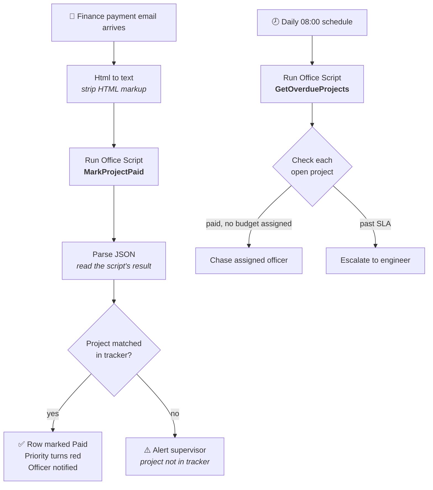

# Connection Charge Tracking Automation

A Microsoft 365 automation that stops paid customer projects from being forgotten while
they wait for internal action — built without modifying any of the underlying enterprise
systems.

Created during an engineering internship with a utility's network planning team.

---

## The problem

When a customer paid a connection charge, Finance emailed the planning team. From there,
acting on it depended entirely on a person remembering:

- The email landed in **one busy inbox**, and the payment status never reached the shared
  tracking spreadsheet.
- When an engineer **rejected** a cost estimate, the approval task was completed and vanished
  from their inbox. Nothing in any system still held the item open.
- So a project whose customer had **already paid** could sit untouched — and nobody found out
  until the customer complained.

## The constraint

The two systems involved — the ERP (SAP) and the customer-facing application portal — **could
not be modified.** No configuration changes, no plugins, no change requests.

So the solution had to sit entirely outside them, using tools the organisation already
licensed: Power Automate, Excel Online, Outlook and SharePoint. Every connector used is a
standard Microsoft 365 one — no premium licensing.

---

## How it works

**Flow 1 — Payment Watcher.** Reads the project reference out of the email subject, finds that
row in the tracker, marks it paid, and notifies the assigned officer. Around eight seconds,
no human involvement.

**Flow 2 — Daily Watchdog.** Every morning it checks for projects that have stopped moving and
chases whoever owns them. Crucially, this needs **no signal from the ERP at all** — it detects
a *stall*, so it catches a forgotten rejection, an officer on leave, or a submission nobody
looked at, all with one mechanism.

---

## Repository contents

| File | What it is |
|---|---|
| [`PowerAutomate_Build_Guide.md`](PowerAutomate_Build_Guide.md) | Full build guide — all three Office Scripts (TypeScript) plus step-by-step flow configuration |
| [`Connection_Tracker.xlsx`](Connection_Tracker.xlsx) | The tracker: automatic priority, SLA aging, calculated columns, conditional formatting |
| [`Finance_Email_Format_Request.md`](Finance_Email_Format_Request.md) | The standard email format requested from Finance to make notifications machine-readable |

### The Office Scripts

- **`MarkProjectPaid`** — extracts the project reference from an email and updates the matching row
- **`GetOverdueProjects`** — returns everything breaching its SLA, with an escalation level per item
- **`MarkProjectRejected`** — records a rejection, restarts the SLA clock, increments the rework counter

---

## Design decisions worth noting

**The SLA lives in the spreadsheet, not the code.** Different project types have different
deadlines (10, 12 or 14 days). Rather than hardcoding a rule, each row carries its own SLA
value and every calculation derives from it — so when practice changes, nobody needs a
developer.

**Match on the subject phrase, not the sender.** Different people in Finance send these
emails from their own accounts, but the subject wording is consistent.

**Payment alone isn't the finish line.** Finance's emails specifically concern payments that
have landed *without a budget assignment* — the money sits in a suspense account until
someone acts. So the tracker tracks that separately and keeps chasing until it's confirmed.

**Multi-project emails can't be silently half-handled.** The script counts every reference it
finds and warns when there's more than one. Marking one project and quietly ignoring two
others would recreate the exact failure the project exists to prevent.

**AI extraction was evaluated and rejected.** AI Builder could parse these emails, but it needs
premium credits, and a deterministic pattern match against an agreed format is more reliable
and fully explainable from the run history. AI would only earn its place doing OCR on a pasted
screenshot — which a plain-text email block solves for free.

**Nothing production-critical should depend on one person's account.** Office Scripts live in
the author's OneDrive and flows watch their creator's mailbox, so both would break when that
account is disabled. The handover path moves the flow to a shared mailbox and the script to
SharePoint.

---

## Note on data

All project references, customer names, and email addresses in this repository are
**fictional examples**. No real customer data, internal documents, or company records are
included.
